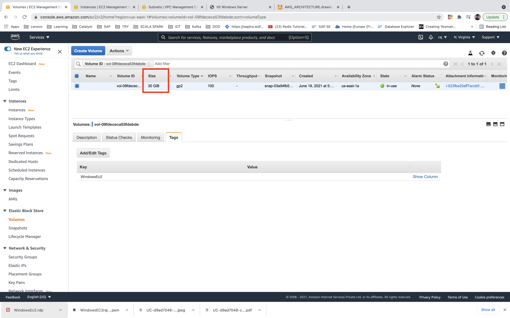

# Amazon web services

## Advantages
-   High Availability - resources / your data is available 24/7
-   Fault tolerant    - your data is stored as a multiple copies, so even if one of the copy is corrupted we have other copies with which we can get the uncorrupted data
-   Scalability       - you can scala up the application / data just by adding additional resources
-   Elasticity        - Dynamically we can scale up / down the services at runtime.

## Regions, Availability Zones
-   Region is a separate geo-graphical area.
-   Each region has multiple isolated location known as Availability Zones
-   Each Availability zones is isolated, but the Availability Zones in region are connected through low latency links.
-   Each Availability zone is represented by name.
-   Availability Zones are separate, physical AWS data centers are located.

## VPCs (Virtual private cloud), Subnets
-   Virtual private cloud is a private sub-section of AWS where we can place AWS resources and allow/restrict access to them.
-   Logically isolated section of AWS cloud.
-   VPC can be used to host your resources.
-   VPC has a collection of subnets. each subnet would then host your resources.
-   Default VPC gets created when the account is created. it has a CIDR(Classless inter domain routing) block of 172.31.0.0/16.
-   Default VPC has a default subnet and an internet gateway. It comes with pre-built NACL, Security Groups and DHCP Options.

-   Each subnet corresponds to only one Availability Zone.

-   Subnets
    -   short hand for sub-network, is a sub section of network.
    -   When you create a VPC, it spans all of the AZ in the region, after creating the VPC, you can add one or more subnets in each AZ. each subnet must reside entirely within one AZ and cannot span zones.    
    -   Public Subnet
        -   Public subnet is connected to internet. So resources can be accessed from the internet which are in this subnet. This is idea for hosting web servers.
    -   Private subnet
        -   private subnet doesn't have a connection to internet. It is ideal for hosting database servers.
        -   private subnet can be connected to internet via NAT (Network Address translation) instance or NAT Gateway to download the updates.
        -   There is no way that private subnet talks to internet directly. It has to go via Public subnet which has an EC2 instance of type NAT. NAT AMI image available.
-   Public and Private subnet comes with their own route table.
-   Creating VPC
    -   VPC with single public subnet
    -   VPC with public and private subnets (NAT)
    -   VPC with public and private subnets and Hardware VPN access.
    -   VPC with private subnet and hardware VPN access.
-   VPC can be attached to one Internet Gateway at a time    

 
## Internet Gateway (IGW)
-   A combination of hardware and software that provides your private network with a route to the world outside (meaning the internet) of the VPC.
-   An internet gateway is horizontally scaled, redundant and highly available VPC component that allows the communication between instance in your VPC and the internet.
    It therefore imposes no availability risks or bandwidth constraints on your network traffic.
-   Default VPC already has an IGW attached.
-   One IGW can be attached to One VPC at a time.
-   An IGW can not be detatched from a VPC while there are active AWS resource in the VPC (Such as an EC2 instance or RDS database )

## Route Table
-   a route table contains a set of rules called routes, that are used to determine where network traffic is directed.
-   Default VPC already has a main route table
-   Unlike an IGW, you can have multiple active route tables in a VPC
-   You cannot delete a route table if it has dependencies(associated subnets)

## EC2 (Elastic Cloud Computing)
-   EC2 is a virtual computer that we can use for whatever we like.
-   Amazon EC2 is good for any type of processing activity.
-   Amazon Elastic compute cloud provides scalable computing capacity in the AWS cloud.
-   EC2 Purchasing options 
    -   On-demand
        -   Most expensive and Most flexible
    -   Reserved
        -   It allows you to purchase an instance for a set of time period ( 1 or 3 years). Which helps in significant price discount compared to ondemand.
    -   Spot
        -   Spot pricing is a way for you to bid on an instance type, then only pay for and use that instance when the spot price is equal to or below your bid price.
-   **AMAZON MACHINE IMAGE (AMI)**  
    -   a pre-configured package required to launch an EC2 instance that includes an Operating System, software packages and other required settings.
    -   Selecting an EMI
        -   Community AMIs
            -   Free to use
            -   Generally with these AMIs you are just selecting the OS you want.
        -   AWS market place AMIs
            -   Pay to use
            -   Generally comes packaged with additional, licensed software
        -   My AMIs
            -   AMI that you create yourself
-   Instance type
    -   Instance type is the CPU(Central processing unit) of your instance.
    -   When you launch an instance, the instance type that you specify determines the hardware of the host computer used for your instance.
    -   Instance type components
        -   Family  
            -   a way of categorizing the instance types based on what they are optimized to do.
            -   Instance types (think CPU)
                -   General purpose
                -   Compute optimized
                -   FPGA instance
                -   GPU Graphics
                -   GPU compute
                -   GPU instances    
                -   Accelerated computing
                -   Memory optimized
                -   Storage Optimized
        -   Type
            -   Sub category for each family type
        -   vCPUs
            -   Number of virtual CPUs the instance type uses
        -   Memory (GiB)
            -   The amount of RAM the instance type uses
        -   Instance storage (GB)
            -   the local instance storage volume
        -   EBS-Optimized available
            -   Indicates if EBS-Optimized is an option for the instance types
        -   Network Performance
            -   Network performance rating based on its data transfer rate(bandwidth capacity)
-   IP Addressing
    -   Providing an EC2 instance with public IP Address.
    -   An IP address is the instances "address" on the network
    -   Private IP Address
        -   By default,all EC2 instaces have a private IP address.
        -   private IP Addresses allow for instances to communicate with each other, as long as they are located in the same VPC.
    -   Public IP Address
        -   Public IP Addresses are required for the instance to communicate with the internet.

-   Steps to choose the right EC2 instance    
    -   Select right **AMAZON MACHINE IMAGE** (AMI)
        -   Instance store 
            -   The storage is part of physical server
            -   So there is a less latency since storage is physically attached.
            -   Temporary storage so when the instance is stopped or terminated, the data is deleted.
        -   Elastic Block store (EBS)
            -   Network attached storage
            -   We have the option of retaining the data as the storage is attached via network.
    -   Select right instance type
        -   T2  -   Burstable performance
        -   M3,M4   -   Good balance of compute, memory and network
        -   C3,C4   -   Compute optimized
        -   G2  -   Graphic intensive application
    -   Specify the VPC
    -   Specify the subnet
    -   Enable the public IP Allocation
    -   ADD storage
    -   ADD Tags
    -   ADD Security groups
    -   Create or choose an existing key pair

    
## Elastic IP
-   Elastic Ip is a static Ip address that can be attached to our EC2 instance.
-   Each instance launched in a subnet has a public IP configured. This is to talk to internet.
-   Each instance has a private IP configured. This is to talk with instances in the subnet and across subnet.
-   When the instance is stopped nd started the public IP address changes.
-   So inorder to have a fixed Ip address we should use the Elastic IP.

## Network Access control list (NACL)
-   NACL is an optional layer of security to your VPC that act as a Firewall for controlling traffic in and out of one or more subnets.
-   Default VPC already has an NACL in place and associated with the default subnets.     
-   Firewall to control access to and from the subnet
-   If you get abnormal traffic from a set of IP instances, you can block traffic from those IP instances.
-   subnet comes with a default Network ACL. This allows all incoming and outgoing traffic.
-   We can create custom Network ACL.
-   **Note** : Stateless - If traffic is allowed inbound, not necessary the same will be allowed outbound.

-   The first rule allows all kind of request into/from subnet. the second rule will deny all request into/from subnet.
-   NACL will read the table based on rule number in sorted order. If it finds the matching record for a request it applies the rule and ignores the rules after that.
-   a subnet can only be associated with one NACL at a time. 

## Security Groups
-   Security Groups are next level security (after NACL)
-   Security Groups are similar to NACL's they allow or deny traffic. However security groups are found on the instance level. In addition, The way allow/deny rule works are different from NACL's.
-   Main diff between Security Groups and NACL's rule is that NACL's has numbered rule, where as Security Groups doenot have numbered rule.
-   Another Main diff between Security Groups and NACL's rule is that NACL's can have deny rule, where as Security Groups cannot have deny rule.
-   All inbound traffic to instance is denied and outbound traffic is allowed by default.    
-   Security Groups are the firewall to control the access to and from your instances.
-   NACL is for subnets and Security Groups are for instances.
-   We can configure the port that can we allowed(opened) on the instances.
-   Web server - only allow traffic to port 80 and 443. or 3389 for RDP. Port 22 for SSH.

-   Database Server - allow only traffic to port 3306 if you are hosting MySQL instance.
-   Security groups are stateful - if you send a request from your instance, the response traffic for that request is allowed to flow in regardless of inbound security group rule.(unlike in NACL its stateless, both inbound and outbound rule needs to be configured )
-   you can specify separate rules for inbound and outbound traffic
-   When we create Security groups, it has no inbound rules.
-   By default, a security group includes an outbound rule that allows all outbound traffic.

## EBS (Elastic block storage)
-   Storage for EC2 instances
-   Replicated by AWS within AZ to provide high availability.
-   Scale Up and Down as required
-   Create point in time snapshot of the volumes. (If you wanna take the backup snapshots are the way to go)
-   you can keep the volume and attach it to other instances
-   EBS root volume - Set delete on termination flag to zero
-   We can encrypt the EBS Volumes. and this can be done during the creation of the volumn itself.
-   Types of EBS
    -   SSD Backed Storage  -   (General purpose SSD(gp2) and Provisioned IOPS SSD(iop1)) 
        -   Transactional workloads
    -   HDD backed Storage  -    (Optimized HDD(st1) and Cold HDD(sc1))
        -   Primarily on throughput measured in  MB/s, Bigdata workloads.
-   IOPS (Input/output Operations per second)
    -   Amount of data that n be written to or retrieved from EBS per sec.
    -   IOPS are unit of measure representing input/output operations per sec.
    -   Larger the storage size(EBS volume size), the more IOPS the volumes has.
-   By default the EBS root volumes are set to be deleted when the instance is deleted. however you can choose to have EBS Volumes persist after termination.     
-   Snapshots
    -   A snapshot is an image of an EBS volumne that can be stored as a backup of the volumn or used to create a duplicate.
    -   A snapshot is not an active EBS volume. you cannot attach or detach a snapshot to an EC2 instance.
    -   To restore a snapshot, you need to create a new EBS volumn using the snapshot as its template.

-   If volume is unencrypted then the snapshot also is unencrypted.

## Amazon RDS 
-   RDS is a AWS provisioned database service.

## S3 (Secure Software Storage) (Simple storage service)
-   Amazon S3 is a massive storage bucket
-   Object storage (key, value) -> reliable, scalable, low latency
-   S3 provides a web interface that can work with storage
-   you can store data of virtually any format.
-   Virtually unlimited amount of storage
-   S3 objects can range from 0 bytes to 5TB
-   Storage Class
    -   Standard
        -   Designed for general and all-purpose storage
        -   the default storage option
        -   99.99999999999 % object durability
        -   99.99 % object availability
        -   Most expensive storage class
    -   Standard Infrequent Access(Standard_IA)
        -   Designed for objects that you do not access frequently, but must be immediately available when accessed.
        -   99.99999999999 % object durability
        -   99.90 % object availability
        -   Less expensive than standard storage class
    -   OneZone Infrequent Access(OneZone_IA)
        -   Designed for non critical, reproducible objects
        -   99.99999999999 % object durability in a single availability zone
        -   99.5 % object availability
        -   Less expensive than standard storage class and infrequent access
    -   Glacier
        -   Designed for long-term archival storage
        -   May take several hours for objects stored in glacier to be retrieved
        -   99.99999999999 % object durability
        -   cheapest s3 storage class (very low cost)
-   Each storage class has varying attribute that dictates things like
    -   Storage cost
    -   Object availability
    -   Object durability
    -   Frequency of access(to the object)
-   Each object must be assigned a storage class(standard is the default class)       
-   Different classes
    -   Infrequent access   -   less frequently accessed data
    -   Glacier -   long term archive
    -   Reduced redundancy storage  -   Another S3 storage option for storing noncritical, reproducible data at lower levels of redundancy.
    -   S3 data is organized as a Simple Key based store. When you specify a key, you will get the value associated with it.
    -   Amazon S3 provides read-after-write consistency for PUTs of all new objects across all regions and eventual consistency of overwrite PUTS and DELETES.
-   Objects are stored in a bucket
-   Bucket name needs to be unique across all regions.
-   Buckets are globally unique containers for everything that you store in amazon S3.
-   By default, permissions on the object are private. but you can set up access control policies to grant permissions to others.
-   S3 object versioning
    -   Multiple versions of same object. Helps from accidental deletion.
    -   Can retrieve previous version of the object.
    -   Versioning is disabled by default. you need to enable it.
    -   if versioning is enabled after objects are uploaded, then the older objects have a version Id of NULL
    -   Versioning can only be suspended after it has been enabled.
-   ACL - Access control list
    -   Amazon S3 ACLs enable you to manage access to buckets and objects.
    -   Each bucket and object has an ACL attached to it.
    -   When a request is received against resource, Amazon S3 checks the corresponding ACL to verify the requester has the necessary access permissions.
-   Bucket policy
    -   Access policies for your S3 bucket.
-   Static Hosting using S3
    -   Can host static content and client side scripting
    -   doesn't support dynamic content
    -   use in conjunction with Route53 to ensure your custom domain name points to s3 website bucket via an alias record.
-   Encryption is done via advanced encryption standard. 256 by default.
-   Objects are partitioned in S3 based on Keys.
-   S3 multipart-file upload
    -   Used to break a large file into chunks and upload them individually.
    -   Once all the parts are uploaded and parts are assembled by AWS you get the object successfully written to S3.
    -   Recommended for objects of size greater than 100 MB.
-   Object life cycle
    -   An object lifecycle is a set of rules that automate the migration of an object's storage class to a different storage class or its deletion, based on specified time interval.
    -   Lifecycle's functionality is located at bucket level
    -   however, Lifecycle policy can be applied to
        -   The entire bucket
        -   One specific folder within a bucket
        -   One specific object within a bucket
    -   you can always delete the lifecycle policy or manually change the storage class back to whatever you like.
    
## RDS (Relational database service)
-   RDS is an SQL database service that provides a wide range of SQL database options to select from.
-   SQL Options include
    -   Amazon Aurora
    -   MySQL
    -   MariaDB
    -   PostgreSQL
    -   Oracle
    -   Microsoft SQL Server
-   AWS RDS is a web service that makes it easier to set up,operate and scale a relational database in the cloud. It provides cost-efficient, resizable-capacity for an industry standard relational databse and manage common database administration task.    

## DynamoDB
-   Standard databases in market - MySQL, Oracle
-   NoSQL -> MongoDB, CouchDB. Key aspect is that you don't need to have a structure predefined for the database.
-   AWS RDS -> PostgreSQL, MySQL, MariaDB, Oracle and Microsoft SQL Server.
-   AWS DynamoDB -> Fully managed NoSQL Database
-   In AWS RDS - eg Oracle, you need to use the service provided by AWS to provision the RDS or install one yourself on an EC2 instance. But in case of DynamoDB you can start directly create the tables.
-   you don't need to worry about patching or scalability, everything is managed by AWS. Reduces the administrative burden on organization. So if the table grows, the space is automatically added.
-   also the data is replicated across three facilities across regions to ensure high availability and durability of data.
-   Tables and Items
    -   An item is a collection of attributes. So items are like rows in traditional databases.
    -   An attribute is a combination of a name and value. This is somewhat like the column of traditional database.
    -   Partition Key -> Primary Key -> Should be unique
-   Provisioned Throughput
    -   Amount of read and write capacity that you provide to your DynamoDB table.
    -   We know that day by day our Data starts to grow. In real time the data will be in GBs and TBs. So number of read and write i.e input/output is very important.
    -   Read Capacity ->    Number of 4Kb reads /sec. There is charge for the read capacity.
        -   Lets say you provide a read capacity of 5. that means you have a total read capacity of 4KB * 5 = 20Kbs /sec
        -   If you have items of more size being read /sec, then they will be queued and have an affect in your application. So you need to decide the capacity based on your application requirements.
        -   Read capacity consistency
            -   Eventual consistency    -   This is where AWS guarantees that when a write operation occurs on an item the data across multiple copies will eventually be consistent. This means that a subsequent read after write can return stale data.
            -   Strong consistency  -   Here AWS guarantees that the read will always return consistent data.
        -   Strong consistency reads are more expensive then eventual consistent reads. on strong consistent read is equal to 2 eventual consistent reads.
    -   Write capacity -> Number of 1KB write /sec. There is a charge for the write capacity.
        -   Lets say you provide a write capacity of 5. That mean you have a total write capacity of 1KB * 5 = 5KB write /sec.
        -   So you need to decied the right capacity based on your application requirement.
-   Scan -> operation returns all items in the table.
-   The filter can be used to return items based on certain attributes.
-   Query -> This can be used to return items based on partition key and sory key.
-   Indexes
    -   Indexes can improve faster access to the table
    -   A secondary index has subnet of attribute from a table
    -   Global secondary index - can have a different partition and sory key attributes from base table.
            -   you need to specify a separate read and write capacity.
            -   In queries you can only request for attributes that are projected into the index.
            -   Queries only support eventual consistent reads.
            -   Can also be created after the table is created.
    -   Local secondary index - needs to have the same partition key attribute but can have a different sort key attribute from the base table.
            -   it can share the same read and write capacity of the base table.
            -   In queries you can only request for attributes that are projected into the index and from base table.
            -   Queries only support eventual and strong consistent reads.
            -   Can only be created at table creation time.
-   Conditional write  
    -   DynamoDB write operations API's - PutItem, UpdateItem and DeleteItem
    -   you only want the item to succeed if a condition succeeds
    

## Security
-   Shared Responsibility Model
    -   Penetration Testing - This is the testing of a system, network or web application to find vulnerabilities that an attacker could exploit.
    -   You need to get a prior request from AWS before conducting a penetration test.

## IAM
-   IAM (Identity and access management)
    -   You can login to AWS console via Username and Password
    -   Inorder to access the services via CLI and SDK you can use the secret keys.
    -   Services can use Roles and this is the preferred method. e.g. EC2 instance wants to use the S3 bucket.
    
    -   So in AWS IAM you can define Users.
    -   Users   -   a person/service that is used to interact with AWS
    -   Groups  -   A collection of Users
    -   Roles   -   A set of permissions assigned to a group of users. e.g. Operations team.
    -   Temporary Access Credentials    -   This is when an application requires a resource for a brief period of time.
    -   The root user   -   Complete access to all services, created when an account is created.
-   IAM is used to securly control the access to AWS resources.
-   IAM is where you manage your AWS Users and their access to AWS accounts and services.
-   IAM is commonly used to manage :
    -   Users
    -   Groups
    -   IAM access policies
    -   Roles
-   The user created when you created the AWS account is called the root user.
-   By default, the root user has **full** administrative rights and access to every part of account
-   By default, any new users you create in the AWS account are created with no access to any AWS Service.
-   For all users except root user, permissions must be given that grant access to AWS Services.
-   MFA
    -   Multi-Factor authentication
    -   Additional layer of security on your root account that is provided by a third party
    -   How do we get MFA code ?
        -   Virtual MFA Device
            -   Smartphone or tablet
            -   Commonly used app -> Google authenticator
        -   Hardware Key Fob
            -   Small physical device with a display that you can attach to your keychain.
            -   Ordered directly from AWS
-   IAM Group is a collection of IAM users. Groups allow you to set and manage permissions for multiple users at the same time.
-   Groups are a more convenient and efficient way to manage account permissions.
    
## AWS CLI
-   you can have control over AWS Services via command line

## AWS CloudFormation
-   Create Templates to automate the creation of AWS resources.
-   Can help create development and test environment faster via scripts.
-   There is no additional charge for using CloudFormation. You can just pay for the underlying resources created via cloudformation.
-   CloudFormation template
    -   Resources(*)    -   Specify the stack resources and their properties (e.g. EC2)
    -   Parameters      -   Specifies values that you can pass in your template at runtime.
    -   Mapping         -   A mapping of keys and associated values that you can use to specify conditional parameter values, similar to lookup table.
    -   Outputs         -   describes the value that are returned whenever you view your stack's properties.

## SNS (Simple Notification Service)
-   SNS is a web service that coordinates and manages the delivery or sending of messages to subscribing endpoints or clients.
-   There are 2 types of clients publishers and subscribers also known as producers and consumers.
-   Push notification service
-   Publish message to a topic
-   You then have different subscribers to a topic
-   the messages are distributed to the various subscribers
-   HTTP, HTTPS - Subscribers specify a URL as part of the subscription registration
-   Email, Email-JSON - Messages are sent to the registered addresses as email.
    -   Email-JSON  -   sends notification as JSONobject
    -   Email       -   sends text based email
-   SQS (Simple Queue Service)    -   Users can specify an SQS standard queue as the endpoint
-   SMS     -   Messages are sent to registered phone number as SMS text messages.
-   Message Format
    -   MessageId   -   Universally unique identifier, unique for each notification published
    -   TimeStamp   -   The time in GMT at which the notification was published.
    -   TopicArn    -   Topic to which the messages was published
    -   Type        -   type of delivery message
    -   UnsubscribeURL  -   a link to unsubscribe the endpoint from the topic
    -   Message     -   The payload (body) of the message
    -   Subject     -   Subject Field
    
## SQS (Simple Queue System)
-   Messaging system provided by AWS
-   Store messages that can shared by other systems
-   Messages can then be processed at a later point in time
-   Helps to decouple systems and works best with distributed systems.
-   SQS Parameters
    -   Default visibility timeout  -   Default timeout when a message becomes invisible after being read (30 sec default)
    -   Message retention           -   How long the messages can be in the queue. Default is 4 days.
    -   Maximum Message Size        -   The maximum message size can be 256 KB.
    -   Receive message wait time   -   Default value is 0 sec. This relates short polling. So even if message is not in the queue, the queue is polled.To allow for less CPU cycles one can enable long polling and set the value to greater than 0 sec.
    

## Elastic Beanstalk
-   Helps provision an environment with a fast turnaround time.
-   Helps get your development team working with a quick up and running development environment.
-   Elastic beanstalk automatically handle the details of capacity provisioning, load balancing, scaling and application health monitoring.
-   Elastic beanstalk supports application developed in Java,PHP, Node.Js, Python, Go ,Ruby and Docker.
-   Steps for creating elastic beanstalk
    -   Create an application
    -   Upload an application version in the form of an application source bundle(e.g. .war) to elastic beanstalk
    -   Elastic beanstalk automatically launches an environment and creates and configure the aws resources.
    -   you can manage new versions of your application and manage multiple environments.
    
## SWF (Simple workflow service)
-   Helps to coordinate work between distributed components of an application
-   Can have workflows and can also have an human intervention as part of that workflow.
-   this ensures the task executed only once. unlike in SQS where its processed atleast once.
-   you have tasks, and you define them as activities.
-   you have a decider task which is used to decide whether task should run, worker tasks based on a certain logic.

## Elastic load balancer
-   Distributes incoming traffic amongst EC2 instances.
-   The ELB itself is highly available.
-   Can combine with auto-scaling service to auto scale instances when the load increases.
-   Can combine with Route-53 to point your custom domain names to the ELB endpoints.
-   Using cookies can be enabled on load balancer. when that is enabled, the user is directed to same backend servers.
    -   Ensure you design your application properly. because if you have a flood of requests, and the requests go to the same backend servers, then the equal distribution of traffic across the EC2 instances will not happen.
-   DNS resolution - when the ELB scales, it changes the IP Address. The load testing client should have the ability to resolve the DNS, else it will keep on going to the same backend instances.    
-   An ELB evenly distributes the traffic between EC2 instances that are associated with it.
-   Load balencer distributes the incoming application traffic across multiple EC2 instances in multiple AZ. This increases the fault tolerance of your application.
    ELB detects the unhealthy instances and routes traffic only to healthy instances.

## Auto scaling
-   auto scaling automates the process of adding(scaling up) or removing(scaling down) EC2 instances based on traffic demand for your application.
-   Auto scaling helps you ensure that you have correct number EC2 instances available to handle the load of your application. 
-   You create the collection of EC2 instances called Auto scaling groups,you can specify the minimum number of instances in auto scaling group and auto scaling ensures that your group never goes below this size.
-   you can specify the maximum number of instances in each auto scaling group, the auto scaling ensures that the group never goes above this size.
-   If you specify the scaling policies, then auto scaling can launch or terminate instances as demand on your application increases or decreases.

## Route 53
-   Route 53 is where you configure and manage web domains for websites or applications you host on AWS.
-   Amazon route 53 performs 3 main functions
    1.  Domain registration : 
        -   Amazon route 53 lets you register domain names(example.com)
    2.  Domain name system(DNS) service : 
        -   Amazon route 53 translate friendly domain names like example.com into IP addresses like 192.0.2.1.
        -   Amazon route 53 responds to DNS queries using a global network of authoritative DNS servers, which reduces latency.
    3.  Health checking :
        -   Amazon route 53 sends automated request over the internet to your application, to verify that its reachable, available and functional.

## CloudFront
-   CloudFront is an AWS service that replicates data, videos and applications around the world to reduce latency, so that access to these resources is fast for the people who will use them.
-   Amazon cloudfront is a web service that speeds up distribution of your  static and dynamic web content such as .html, .css, .js and images to your users
-   CloudFront delivers your content through a worldwide network of data centers called edge location.
-   when a user requests content that you're serving with couldfrount, the user is routed to the edge location that provides lowest latency, so that content is delivered with best possible performance.
-   If the content is already in the edge location with low latency, CloudFront delivers it immediately. If the content is not in that edge location CloudFront retrieves it from an origin(source) that you've defined such as S3 bucket.

## Elastic cache
-   Used to cache the most commonly used items. It's an in memory data store that makes it faster to retrieve data items. Its faster than getting items from EBS volumes or a database.
-   Types of cache
    -   Redis   -   This is popular for webapps, IoT, Gaming applications.
    -   Memcached   -   Popular for storing in-memory objects.
-   AWS takes care of the infrastructure. If there is a failure in the node, then the mode gets replaced.

## AWS Service limits
-   you are limited to running upto at total of 20 on-demand instance across the instance family
-   DynamoDB limit - Except north virginia region the allowed capacity for read and write is 10000 capacity units.
-   5 VPC per region
-   5 Internet gateway per region
-   5 Elastic Ip per region
-   100 S3 buckets

## FIFO Queue
-   First in First Out delivery
-   Order of message is preserved
-   Exactly once processing -  these queues can be addressed so that messages become available to other consumers Only if the message is deleted after being read.
-   Duplicates are not introduced in the queue with the help of **de-duplication id** which can be based on the content or an ID

## AWS Lambda
-   Server less computing on cloud
-   you dont need to provide any infrastructure
-   The compute resources required to execute your code is provided by the lambda service
-   S3 has the provision to execute a lambda function for an event lets say, an event is triggered where an object is put to S3. The event can trigger a lambda function to perform an action such as putting the data about the object in a DynamoDB table.
-   It is the next generation cloud computing that will replace EC2 instance
-   AWS Lambda is a compute service, that lets you run code without provisioning or managing servers. 
-   AWS Lambda executes your code only when needed and scales automatically.
-   you pay only for the compute time you consume - there is no charge when your code is not running
-   AWS Lambda runs your code on High-Availability compute infrastructure and performs all of the administrations of the compute resources, including server and operating system maintenance, capacity provisioning nd automatic scaling, code monitoring and logging.

## Content Delivery Service
-   Allows you to distribute web content, both static and dynamic to users distributed across the globe.
-   The content is distributed via edge locations which are located in different regions.
-   It helps to reduce the load on the origin server.

## NAT (network Address translation)
-   Allows servers in the private subnet to communicate with the internet
-   NAT instance route traffic nd gets the response from the internet on behalf of the servers in the private subnet.
-   It helps secure the servers in the private subnet. Helps also negate putting the servers in the public subnet.
-   A good usecase scenario is where you need to allow servers in the private subnet to download updates from the internet.
-   NAT instance steps
    -   First create an instance of the AMI type - NAT
    -   Ensure the NAT instance in placed in a public subnet.Advisable to put an Elastic IP for the NAT instance.
    -   Ensure the source destination check for the NAT instance is disabled
    -   Change the route table for the private subnet so that request are routed via NAT instance.
-   NAT Gateway
    -   Managed by AWS - you dont need to manually create a NAT instance.
    -   Each NAT Gateway is redundant in nature.
    -   Supports bandwidth bursts of upto 10 Gbps, For NAT instances it depends on the instance type
    -   No maintenance overhead for NAT Gateway
    -   Some cases where we need to use NAT instances
        -   if you want to double up as a Bastion Host
        -   If you want some specific port forwarding
    
## CloudWatch
-   CloudWatch is a service that allows you to monitor various elements of your AWS account.
-   AWS CloudWatch monitors your AWS resources and application you run on AWS in real time.
-   you can use CloudWatch to collect and track metrics, which are variables you can measure for your resources and applications.
-   CloudWatch alarms and sends notification or automatically make changes to the resources you are monitoring based on rules that you define.

## CloudTrail
-   CloudTrail is a service that allows you to track various actions taken while using your AWS account.
-   Amazon CloudTrail is an AWS service that helps you enable governance, compliance, operational, and risk auditing of your AWS account.
-   Actions taken by a user, role or an AWS Service are recorded as events in cloud trail.
-   Events include the action taken in the AWS management console, AWS Command Line interface and AWS SDKs and API's. 

## OpsWork
-   Configuration Management Service
-   Automate how servers are configured, deployed and managed across EC2 instances and on-premise infrastructure.
-   Can also be used in accordance with Chef.
-   It is similar to elastic beanstalk and cloud formation

# Things which are not clear
-   CIDR
-   Security Groups
-   DHCP

## Tips
-   Create Duplicate services in multiple availability zones(subnets) to recover from AZ Failure.
-   